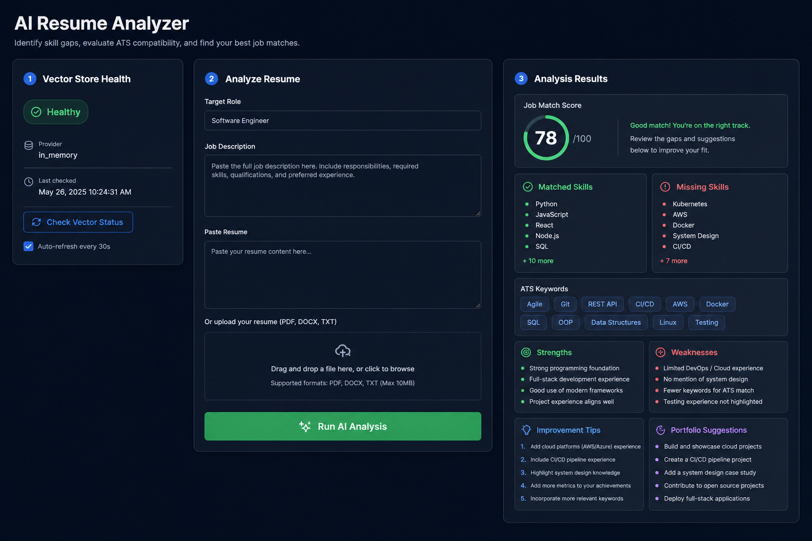

# AI Resume Analyzer (Full Stack)

An AI-powered web application that helps job seekers optimize resumes for specific roles with:
- Skill Gap Analysis
- ATS Keyword Optimization
- AI Feedback (strengths, weaknesses, improvement tips)
- Job Match Score
- Portfolio/Certification Suggestions

## Live Demo
- Frontend: http://localhost:3000  
- Backend API: http://localhost:5000

## UI Preview

Full dashboard mockup (vector health, resume analysis form, and results):



## Problem
Many candidates apply with generic resumes that fail ATS filters and do not align with job descriptions.

## Solution
This platform analyzes a resume against a target job description using AI + semantic retrieval and provides:
- role-specific keyword suggestions,
- skill gap insights,
- practical improvement guidance,
- and an overall match score.

## Impact
- Improves resume relevance for target jobs
- Helps increase ATS compatibility
- Gives clear action items for upskilling and portfolio improvements

## Features
- User authentication (JWT)
- Resume input via paste or file upload (`.pdf`, `.docx`, `.txt`)
- AI-generated structured feedback
- ATS keyword recommendations
- Vector-store health check endpoint + UI badge
- Auto-refresh vector health monitoring (every 30s toggle)

## Tech Stack

### Frontend
- Next.js
- React

### Backend
- Node.js
- Express.js

### Database
- MongoDB (Mongoose)

### AI + RAG
- OpenAI (chat + embeddings)
- Vector provider switch: In-memory / Pinecone / Weaviate

## Architecture Overview
1. User uploads/pastes resume + job description
2. Backend parses resume text
3. Embeddings generated for semantic context
4. RAG retrieves relevant context
5. LLM returns structured feedback + score
6. Result saved in MongoDB and shown on dashboard

## Project Structure

```text
ai-resume-analyzer-fullstack/
├── assets/
│   └── ai-resume-analyzer-ui-mockup.png
├── backend/
│   ├── src/
│   │   ├── config/
│   │   ├── middleware/
│   │   ├── models/
│   │   ├── routes/
│   │   ├── services/
│   │   ├── utils/
│   │   └── server.js
│   ├── .env.example
│   └── package.json
├── frontend/
│   ├── app/
│   ├── components/
│   ├── lib/
│   ├── .env.local.example
│   └── package.json
├── docs/
└── README.md
